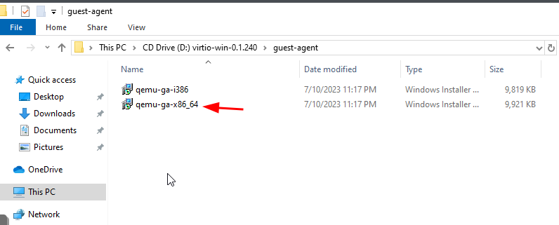

# Prerequisites:

> [!IMPORTANT]
> - **A Windows ISO**
> - **VirtIO Drivers**: Download the VirtIO driver ISO from https://pve.proxmox.com/wiki/Windows_VirtIO_Drivers
> - Default creds: wazy:wazy

# Install Windows on Proxmox

## Step 1: Upload ISO to Proxmox

1. **Login to Proxmox Web Interface**:
   - Open your web browser and navigate to your Proxmox VE IP address.
   - Login with your credentials.

2. **Upload Windows 10 ISO**:
   - Navigate to **Datacenter > Storage > local > ISO Images**.
   - Click on **Upload** and select the Windows 10 ISO file.

3. **Upload VirtIO Drivers ISO**:
   - Similarly, upload the VirtIO driver ISO to the same location.

## Step 2: Create a New Virtual Machine

1. **Create VM**:
   - Click on **Create VM** on the top-right corner.
   - Fill in the VM details:
     - **Node**: Select your Proxmox node.
     - **VM ID**: Leave as default or specify an ID.
     - **Name**: Give your VM a meaningful name (e.g., Windows10Template).

2. **OS Configuration**:
   - **OS**: Select `Microsoft Windows 10/2016/2019`.
   - **ISO Image**: Select the uploaded Windows 10 ISO.

3. **System Configuration**:
   - **Type**: Default (i440fx).
   - **Machine**: Default (pc-i440fx).
   - **BIOS**: OVMF (UEFI).

4. **Hard Disk**:
   - **Bus/Device**: Select `VirtIO Block`.
   - **Disk Size**: Set your desired disk size (e.g., 64GB).

5. **CPU**:
   - **Cores**: Set the number of cores (e.g., 2).

6. **Memory**:
   - **Memory**: Set the memory size to 8192.

7. **Network**:
   - **Model**: Select `Intel E1000`.

8. **Confirm**:
   - Review your settings and click **Finish**.

## Step 3: Install Windows 10

1. **Start VM**:
   - Select your newly created VM and click on **Start**.
   - Open the console to view the installation.

2. **Windows Setup**:
   - Proceed with the Windows 10 installation steps.
   - Make sure you select the the option `Domain Joined`. That way it will allow you to create a user and password. Instead of logging in with your microsoft account.
   - This might take a while, so be patient.
3.  Update the Windows 10. 

## Step 4: Install QEMU Guest Agent and Virtio ISO

1. **Install QEMU Guest Agent**:
	- Once you are in the vm and it has finished rebooting and updating. You will go to the Proxmox console and add the `virtio.iso` .
   
	   - Navigate to the VirtIO ISO and select the appropriate driver for your disk and network.
	 
	- You can also install the QEMU Guest Agent, Select `guest-agent`.
	- And select `qemu-ga-x86_64` and install it.
	

2. **Enable QEMU Guest Agent**:
   - In Proxmox, go to your VM’s **Options** tab.
   - Enable the **QEMU Guest Agent**.

## Step 5: Install CloudBase Init
1. Install cloudbase-init build from the official site: https://cloudbase.it/cloudbase-init/#download
2. Why Continous Build? Because the stable build dates from 2020 and doesn't include functionalities we use.
   
   
   
## Step 5: Sysprep and Convert to Template

1. **Sysprep**:
   - Open a command prompt as an administrator within Windows 10.
   - Run `sysprep /oobe /generalize /shutdown`.

2. **Convert to Template**:
   - After the VM shuts down, go to Proxmox.
   - Right-click on your VM and select **Convert to Template**.

## Step 6: Create VMs from Template

1. **Deploy VM from Template**:
   - Right-click on your template and select **Clone**.
   - Follow the prompts to create a new VM based on the template.

## Conclusion

You now have a Windows 10 template in Proxmox that you can use to quickly deploy new virtual machines. This template includes the VirtIO drivers and QEMU Guest Agent, ensuring optimal performance and manageability.
